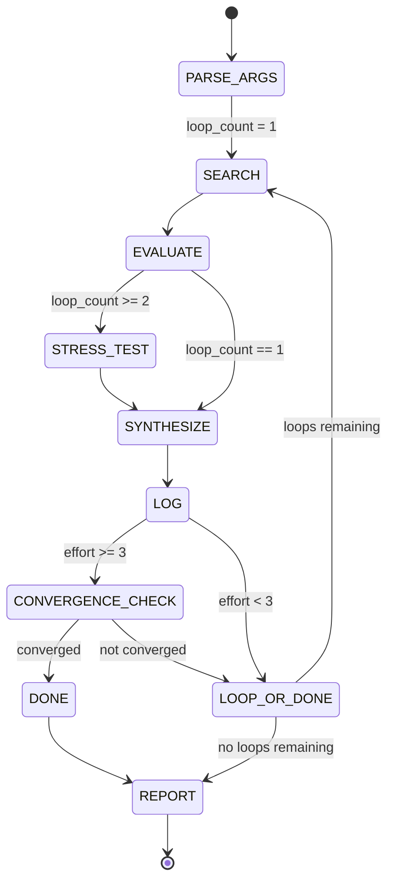
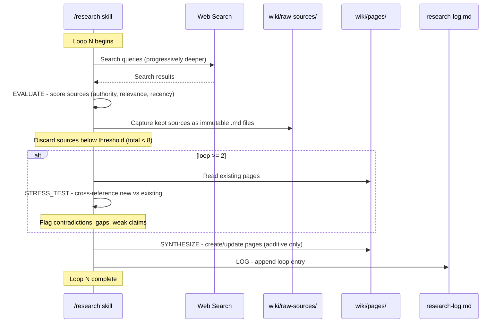

# Specification: Autoresearch Skill Upgrade

## Summary

Upgrade the `/research` slash command from a single-pass web-search-and-generate workflow to an autonomous iterative research loop inspired by Karpathy's autoresearch pattern. The new skill runs multiple bounded research loops that progressively deepen coverage, stress-test findings against prior knowledge, and only promote validated claims to wiki pages. A persistent research log provides full provenance for every loop.

This is a **prompt-file rewrite** (`.claude/commands/research.md`) plus **schema updates** (`wiki/schema.md`, `CLAUDE.md`). No backend code changes are required.

## Requirements

### Functional Requirements

1. **FR-001** The skill accepts the invocation format: `/research <topic> [--effort <1-5>] [--loops <N>] [--focus <subtopic>]`
2. **FR-002** If `--effort` is omitted, default to effort level 2 (standard).
3. **FR-003** If `--loops` is explicitly provided, it overrides the effort-level default loop count.
4. **FR-004** If `--focus` is provided, every loop constrains its search queries to the given subtopic within the broader topic.
5. **FR-005** Each research loop executes five phases in order: SEARCH, EVALUATE, STRESS_TEST, SYNTHESIZE, LOG.
6. **FR-006** The SEARCH phase finds new sources not already captured in `wiki/raw-sources/<topic-slug>/`. Loop depth increases progressively (see Effort Level Behavior Matrix).
7. **FR-007** The EVALUATE phase scores each discovered source on three dimensions: authority (0-5), relevance (0-5), recency (0-5). Sources scoring below a threshold (total < 8) are discarded with a logged reason.
8. **FR-008** The STRESS_TEST phase (loop 2+) cross-references new findings against existing wiki pages and prior-loop findings, checking for contradictions, unsupported claims, missing perspectives, and outdated information.
9. **FR-009** The SYNTHESIZE phase creates or updates wiki pages. Updates are additive: new sections are appended, existing sections are amended with inline markers for changed claims, and "Controversies" or "Open Questions" sections are added when sources disagree.
10. **FR-010** The LOG phase appends a structured entry to `wiki/pages/<topic-slug>/research-log.md`.
11. **FR-011** At effort level 3+, if a loop produces zero new information, zero contradictions, and zero new sources kept, the skill terminates early and reports "converged after N loops".
12. **FR-012** The final report (Step 5 equivalent) includes per-loop summaries plus aggregate statistics: total sources captured, pages created/updated, claims validated/invalidated, and convergence status.
13. **FR-013** Existing raw sources are never modified. New captures always create new files, even for the same URL (append timestamp suffix for re-fetches).
14. **FR-014** Existing wiki page content is never deleted by the skill. Updates only add, amend, or annotate.

### Non-Functional Requirements

1. **NFR-001** Deterministic ordering: the skill must execute loops sequentially (loop N completes fully before loop N+1 begins) so each loop can build on prior results.
2. **NFR-002** Bounded scope: each loop must stay within the source-count bounds defined by the effort level, preventing unbounded token consumption.
3. **NFR-003** Resumability hint: the research log must contain enough state that a human or future invocation can understand where a prior run left off and what remains unexplored.
4. **NFR-004** Backward compatibility: invoking `/research <topic>` with no flags must produce behavior equivalent to effort level 2 (2 loops, 3-5 sources per loop), which is a superset of the original single-pass behavior.

## Architecture

### Loop State Machine



### Data Flow Per Loop



### Wiki Directory Structure (after research)

```
wiki/
  raw-sources/
    <topic-slug>/
      <source-slug>.md                    # existing format, unchanged
      <source-slug>-20260426T1953.md      # re-fetch of same URL
  pages/
    <topic-slug>/
      _index.md                           # existing, updated
      <concept>.md                        # existing format, new fields
      research-log.md                     # NEW - per-topic research log
```

## Effort Level Behavior Matrix

| Effort | Label      | Sources/Loop | Loops (default) | Search Depth Strategy                                           | Stress-Test | Convergence Check |
|--------|------------|--------------|-----------------|----------------------------------------------------------------|-------------|-------------------|
| 1      | quick      | 2-3          | 1               | Overview: top search results, official docs                    | No          | No                |
| 2      | standard   | 3-5          | 2               | L1 overview + L2 deeper technical/primary sources              | L2 only     | No                |
| 3      | thorough   | 5-8          | 3               | L1 overview + L2 primary/academic + L3 contrarian/alternative  | L2+         | Yes               |
| 4      | exhaustive | 8-12         | 4               | L1-L3 as above + L4 meta-analyses, systematic reviews          | L2+         | Yes               |
| 5      | definitive | 12+          | 5 (max 8)       | All above + seek original primary sources, datasets, standards | L2+         | Yes (converge or max) |

### Progressive Search Depth by Loop Number

| Loop | Search Strategy                                                                |
|------|--------------------------------------------------------------------------------|
| 1    | Broad overview queries. Official docs, Wikipedia, authoritative intro sources. |
| 2    | Targeted deep queries. Academic papers, technical specs, primary sources.       |
| 3    | Contrarian/alternative queries. "criticism of X", "alternatives to X", "X vs Y". |
| 4    | Meta-level queries. Systematic reviews, comparison studies, historical evolution. |
| 5+   | Gap-filling queries. Driven by open questions identified in prior loops.        |

## Source Scoring Criteria

Each source is scored on three axes (0-5 each, max total 15):

### Authority (0-5)
- **5**: Peer-reviewed journal, official specification, recognized standards body
- **4**: Established institution (.edu, .gov), well-known expert's personal site
- **3**: Reputable tech publisher (e.g., O'Reilly), major conference proceedings
- **2**: Well-known blog/platform (e.g., popular Substack, established Medium author)
- **1**: Forum post, Q&A site answer with evidence of expertise
- **0**: Anonymous or unverifiable authorship

### Relevance (0-5)
- **5**: Directly addresses the topic; primary source for the concept
- **4**: Closely related; covers the topic as a major section
- **3**: Partially relevant; useful context or background
- **2**: Tangentially related; one useful paragraph or data point
- **1**: Marginally relevant; confirms one minor fact
- **0**: Off-topic or too generic to be useful

### Recency (0-5)
- **5**: Published within the last 6 months
- **4**: Published within the last 1 year
- **3**: Published within the last 2 years
- **2**: Published within the last 5 years
- **1**: Published within the last 10 years
- **0**: Older than 10 years (exception: foundational/seminal works score 3 regardless)

**Keep threshold**: Total score >= 8. Sources below 8 are discarded. The skill logs the score and reason for every evaluated source (kept or discarded).

## Convergence Detection Logic

At effort level 3+, after each loop's LOG phase, check:

1. **New sources kept this loop** = 0
2. **New contradictions found** = 0
3. **New open questions identified** = 0

If all three conditions hold, declare convergence. The skill outputs: "Research converged after {N} loops -- no new information, contradictions, or questions found."

If not converged and loops remain, continue. If `--loops` maximum reached without convergence, the skill reports: "Completed {N} loops without full convergence. Remaining open questions: [list]."

## Research Log Format

File: `wiki/pages/<topic-slug>/research-log.md`

```markdown
---
title: "Research Log: <Topic Name>"
topic: <topic-slug>
type: research-log
created: <ISO 8601 of first loop>
updated: <ISO 8601 of latest loop>
---

# Research Log: <Topic Name>

## Loop 1 -- <ISO 8601 timestamp>

**Effort**: <level> | **Focus**: <subtopic or "general"> | **Search strategy**: <description>

### Sources Evaluated

| Source | Authority | Relevance | Recency | Total | Verdict |
|--------|-----------|-----------|---------|-------|---------|
| <name/url> | 4 | 5 | 3 | 12 | Kept |
| <name/url> | 2 | 3 | 2 | 7 | Discarded -- below threshold |

### Findings
- <key finding 1>
- <key finding 2>

### Actions Taken
- Created: `pages/<topic-slug>/<page>.md`
- Created: `raw-sources/<topic-slug>/<source>.md`

### Confidence Assessment
<overall confidence in current wiki coverage: low/medium/high, with brief justification>

### Next Loop Plan
<what the next loop should search for, what gaps remain>

---

## Loop 2 -- <ISO 8601 timestamp>

**Effort**: <level> | **Focus**: <subtopic or "general"> | **Search strategy**: <description>

### Sources Evaluated
<same table format>

### Stress-Test Results
- **Contradictions found**: <list or "none">
- **Unsupported claims**: <list of claims in existing pages lacking sufficient sourcing>
- **Missing perspectives**: <viewpoints not yet represented>
- **Outdated information**: <claims that newer sources supersede>

### Findings
- <key finding>

### Actions Taken
- Updated: `pages/<topic-slug>/<page>.md` -- added Controversies section
- Created: `raw-sources/<topic-slug>/<new-source>.md`

### Confidence Assessment
<assessment>

### Next Loop Plan
<plan, or "N/A -- research complete" if final loop>

---
```

## Wiki Page Updates -- Additive Policy

When the SYNTHESIZE phase updates an existing wiki page:

1. **New sections**: Append new H2 or H3 sections. Never delete existing sections.
2. **Amended claims**: If a claim is updated based on newer/better sources, keep the original text and add an inline annotation: `(Updated <date>: <revised claim> -- see [source])`. For the initial rollout, this can be simplified to just updating the text and adding the new source to the sources list.
3. **Controversies section**: Added as a new H2 section when sources disagree on a factual claim. Format:
   ```markdown
   ## Controversies

   ### <Claim in dispute>
   - **View A**: <claim> ([source](raw-sources/...))
   - **View B**: <claim> ([source](raw-sources/...))
   - **Assessment**: <which view has stronger evidence and why>
   ```
4. **Open Questions section**: Added as a new H2 section for claims that lack sufficient evidence from any source:
   ```markdown
   ## Open Questions
   - <question> -- <why it remains open, what evidence would resolve it>
   ```
5. **Front-matter updates**: Update `updated` timestamp. Add new sources to `sources` list. Set new fields (`confidence`, `research_loops`, `last_stressed`).

## Schema Updates

### New Front-Matter Fields for Wiki Pages

Add to `wiki/schema.md` under "Optional Fields":

| Field | Type | Description |
|-------|------|-------------|
| `confidence` | string | One of: `low`, `medium`, `high`. Reflects how well-sourced and stress-tested the page content is. |
| `research_loops` | integer | Number of research loops that have contributed to this page. |
| `last_stressed` | string (ISO 8601) | Timestamp of the last stress-test that examined this page. Null/absent if never stress-tested. |

### New Page Type: research-log

Add to `wiki/schema.md`:

```markdown
### Research Logs (`research-log.md`)

Each topic directory may contain a `research-log.md` file that records the provenance of all research conducted on the topic. This file is append-only (new loop entries are added at the bottom). It uses the `type: research-log` front-matter field to distinguish it from regular wiki pages.

Research logs are not ingested into the vector database (they are operational metadata, not knowledge content).
```

## CLAUDE.md Updates

Replace the `/research` skill section with:

```markdown
### /research
Invoke with: `/research <topic> [--effort <1-5>] [--loops <N>] [--focus <subtopic>]`
Prompt file: `.claude/commands/research.md`

Researches a topic using iterative autonomous loops. Each loop searches for sources, evaluates them, stress-tests findings against existing wiki content, synthesizes validated information into wiki pages, and logs its work.

- **--effort**: Controls depth (1=quick, 2=standard default, 3=thorough, 4=exhaustive, 5=definitive)
- **--loops**: Override the default loop count for the chosen effort level
- **--focus**: Constrain research to a specific subtopic

See `.claude/commands/research.md` for the full skill prompt.
```

## Technology Decisions

| Decision | Choice | Rationale |
|----------|--------|-----------|
| Implementation medium | Claude Code slash command (markdown prompt) | Matches existing architecture. No backend changes needed. The skill is executed by Claude Code's agent loop which already has web search and file I/O capabilities. |
| State persistence | Append-only research-log.md per topic | Simple, git-trackable, human-readable. No database needed for research state. |
| Source scoring | 3-axis numeric (authority/relevance/recency) with threshold | Gives the LLM concrete rubric to follow rather than subjective "is this good?" judgments. Threshold of 8/15 filters roughly the bottom half. |
| Convergence detection | Zero-delta heuristic (no new sources, contradictions, or questions) | Simple to implement in a prompt. Avoids complex similarity scoring between loops. |
| Page update policy | Additive only, never delete | Prevents the skill from accidentally destroying user-curated content. Worst case is redundancy, which is preferable to data loss. |

### ADR-001: Iterative Loop in a Single Skill Invocation

**Status**: Proposed
**Context**: The autoresearch pattern requires multiple sequential loops. We could implement this as (a) a single skill invocation that runs all loops, (b) multiple separate skill invocations coordinated by the user, or (c) a backend orchestrator.
**Decision**: Single skill invocation. The prompt instructs Claude to run all loops sequentially within one invocation, using the research log as its working memory between loops.
**Consequences**: Simpler UX (one command, walk away). Risk of hitting context length limits on effort 5 with large topics. Mitigation: the effort budget bounds source counts per loop, and the prompt instructs Claude to summarize prior loops rather than re-reading all raw sources.

### ADR-002: Source Scoring as Prompt Rubric (not Code)

**Status**: Proposed
**Context**: Source quality evaluation could be implemented as (a) a structured rubric in the prompt that the LLM self-applies, (b) a separate code-based classifier, or (c) a separate LLM call.
**Decision**: Prompt rubric. The scoring criteria are embedded directly in the skill prompt. The LLM scores each source and logs the scores in the research log.
**Consequences**: No code to maintain. Scores are subjective and may vary between invocations. The research log provides transparency -- the user can audit scores and override if needed. Acceptable for a personal knowledge wiki where the user is the final arbiter.

### ADR-003: Research Log as Append-Only Markdown

**Status**: Proposed
**Context**: Research state could be stored as (a) a markdown file in the wiki, (b) a JSON state file, or (c) a database record.
**Decision**: Markdown file in `wiki/pages/<topic>/research-log.md`. Append-only.
**Consequences**: Human-readable, git-diffable, requires no infrastructure. Slightly harder to parse programmatically than JSON, but this is a prompt-driven system -- the LLM reads markdown natively. The log is excluded from vector ingestion to avoid polluting search results with operational metadata.

## Constraints

- The skill prompt must work within Claude Code's slash command system (single markdown file, no code execution beyond what Claude Code provides).
- Web search is performed by Claude Code's built-in web search tool. The skill cannot control search engine selection or pagination.
- The skill cannot guarantee deterministic source scoring -- scores are LLM-generated and may vary. The research log provides auditability.
- Context window limits may constrain effort level 5 on very large topics. The prompt should instruct Claude to summarize and compress prior loop context when approaching limits.

## Out of Scope

- Backend changes (no Python/FastAPI modifications).
- Frontend changes (no UI for research status or log viewing).
- Automated scheduling or cron-based re-research.
- Multi-topic research in a single invocation.
- Source re-fetching or link-rot detection for previously captured sources.
- Integration with citation managers or academic databases (Semantic Scholar, etc.) -- future enhancement.
- Vector database ingestion changes (research logs are excluded by convention, not by code enforcement).

## Open Questions

- **Q1**: Should effort level 1 (quick, 1 loop) skip the research log entirely, or write a minimal entry? -- Suggested answer: always write a log entry, even for single-loop runs. Consistency is more valuable than the small overhead.
- **Q2**: Should the `--focus` flag create a separate sub-directory under the topic, or add focused pages to the same topic directory? -- Suggested answer: same directory. The focus is a search constraint, not a structural one. Pages should be named by their concept regardless of how they were discovered.
- **Q3**: What happens if the user runs `/research <topic>` on a topic that already has wiki pages and a research log from a prior run? -- Suggested answer: the skill reads the existing research log to understand prior coverage, then begins its loops from where the prior run left off (e.g., if prior run did 2 loops at effort 2, a new effort 3 run starts its loop numbering from 3 and its stress-testing uses all prior content).

## Files to Create or Modify

| File | Action | Description |
|------|--------|-------------|
| `.claude/commands/research.md` | **Rewrite** | Complete replacement with the autoresearch prompt |
| `wiki/schema.md` | **Update** | Add `confidence`, `research_loops`, `last_stressed` fields; add research-log page type |
| `CLAUDE.md` | **Update** | Update `/research` skill documentation with new signature and description |
