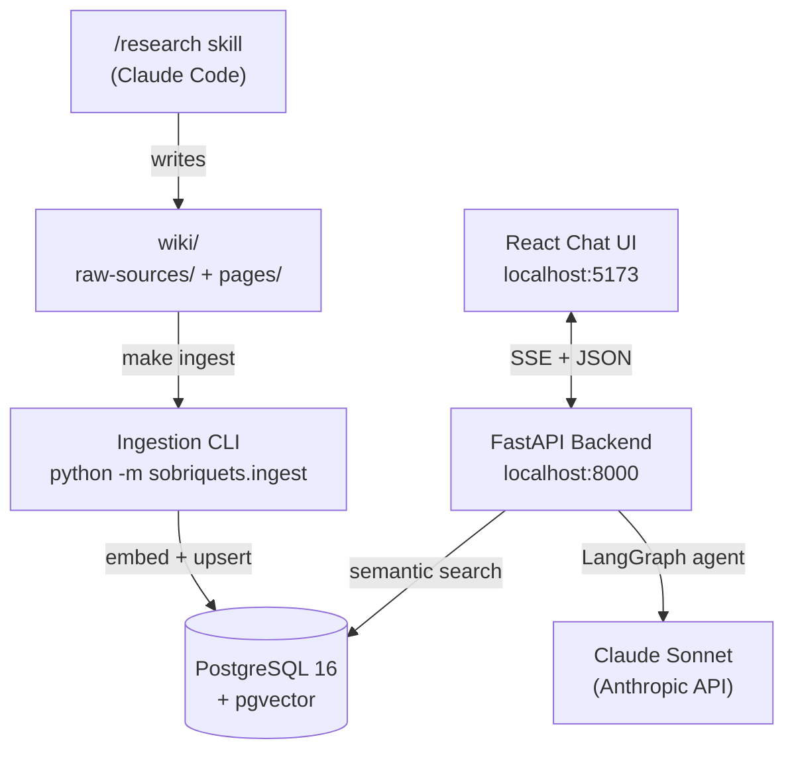

# Sobriquets

A personal knowledge wiki system following Karpathy's three-layer LLM Wiki pattern. Use the `/research` Claude Code skill to build structured wiki pages from authoritative sources, then chat with your knowledge base through a streaming React frontend backed by a LangGraph agent and pgvector.

## Installation

### Option 1: Clone the repo (full system)

Clone the repo to use both the `/research` skill and the full-stack chat application:

```bash
git clone https://github.com/joestein/sobriquets.git
cd sobriquets
```

The `/research` skill is automatically available as a Claude Code slash command when you open this project.

### Option 2: Install as a Claude Code plugin (skill only)

Install the `/research` skill into any project without cloning the full repo:

```bash
# Add the marketplace
claude plugin marketplace add github.com/joestein/sobriquets

# Install the plugin
claude plugin install sobriquets@sobriquets-marketplace
```

Once installed, the skill is available as `/sobriquets:research <topic>` in any project.

## Quick Start

```bash
# 1. Copy and configure environment
cp .env.example .env
# Edit .env — set ANTHROPIC_API_KEY at minimum

# 2. Start all services
make up

# 3. Run database migrations
make migrate

# 4. Research your first topic (in Claude Code)
/research quantum computing                    # standard depth (effort 2, 2 loops)
/research quantum computing --effort 4         # exhaustive (4 loops, stress-tested)
/research quantum computing --focus hardware   # constrain to a subtopic

# 5. Ingest the wiki pages into the vector database
make ingest

# 6. Open the chat UI
open http://localhost:5173
```

## Prerequisites

- Docker and Docker Compose (v2)
- Claude Code with internet access (for the `/research` skill)
- An Anthropic API key (for the chat agent)

Optional: An OpenAI API key if you prefer OpenAI embeddings over the local default.

## Architecture



### Three-Layer Wiki Pattern

| Layer | Location | Mutability |
|-------|----------|------------|
| Raw Sources | `wiki/raw-sources/` | Immutable — never edited after creation |
| Wiki Pages | `wiki/pages/` | Regenerated/updated by `/research` |
| Schema | `wiki/schema.md` + `CLAUDE.md` | Manually maintained |

### Research Skill

Invoke from Claude Code:

```
/research <topic> [--effort <1-5>] [--loops <N>] [--focus <subtopic>]
```

| Flag | Description |
|------|-------------|
| `--effort` | Depth level (default 2). Controls sources per loop, default loop count, and whether stress-testing and convergence detection run. |
| `--loops` | Override the default loop count for the chosen effort level. |
| `--focus` | Constrain every search query to a specific subtopic. |

**Effort levels at a glance:**

| Level | Label | Default Loops | Stress-Test | Convergence Check |
|-------|-------|---------------|-------------|-------------------|
| 1 | quick | 1 | No | No |
| 2 | standard | 2 | Loop 2 only | No |
| 3 | thorough | 3 | Loop 2+ | Yes |
| 4 | exhaustive | 4 | Loop 2+ | Yes |
| 5 | definitive | 5 (max 8) | Loop 2+ | Yes |

Each loop runs five phases: **SEARCH** (find sources) → **EVALUATE** (score authority/relevance/recency, keep threshold 8/15) → **STRESS_TEST** (check contradictions and gaps against prior content) → **SYNTHESIZE** (write or update wiki pages) → **LOG** (append to `research-log.md`). At effort 3+, loops stop early when no new sources, contradictions, or open questions are found.

Full prompt and scoring rubric: `.claude/commands/research.md`

### Data Flow

1. Run `/research <topic> [--effort <1-5>] [--loops <N>] [--focus <subtopic>]` in Claude Code — the skill runs sequential research loops (count determined by effort level), fetching and scoring sources each loop, stress-testing findings against existing wiki content, and synthesizing validated information into structured markdown pages in `wiki/pages/`. Raw source snapshots are saved to `wiki/raw-sources/` and a per-topic research log tracks loop history.
2. Run `make ingest` — the ingestion pipeline scans `wiki/pages/`, chunks each page by heading, generates embedding vectors, and upserts into pgvector. Unchanged files (by SHA-256 hash) are skipped.
3. Open the chat UI and ask questions — the LangGraph agent calls `search_knowledge_base`, retrieves relevant chunks via cosine similarity, and streams a synthesized answer with source citations.

### LangGraph Agent

```
START -> agent_node (LLM call)
              |
         has tool calls?
         /           \
    tool_node        END
    (execute)
         \
          -> back to agent_node
```

Agent tools: `search_knowledge_base`, `list_wiki_pages`, `get_wiki_page`

## Tech Stack

| Component | Technology |
|-----------|-----------|
| Database | PostgreSQL 16 + pgvector (HNSW index) |
| Backend | Python 3.11, FastAPI, SQLAlchemy (async), Alembic |
| Agent | LangGraph, LangChain, Claude Sonnet |
| Embeddings | sentence-transformers `all-MiniLM-L6-v2` (local, 384-dim) or OpenAI API |
| Frontend | React 18, TypeScript, Vite, Tailwind CSS |
| Streaming | Server-Sent Events (SSE) |

## Project Structure

```
sobriquets/
  CLAUDE.md                  # Project conventions + skill registration
  Makefile                   # Dev workflow targets
  docker-compose.yml         # All services
  .env.example               # Configuration template

  .claude-plugin/
    plugin.json              # Plugin metadata (v0.1.0)
    marketplace.json         # Marketplace distribution config

  wiki/                      # Knowledge base (git-tracked)
    schema.md                # Wiki structure conventions
    raw-sources/             # Immutable source snapshots
    pages/                   # Generated wiki pages

  .claude/commands/
    research.md              # /research slash command

  backend/
    sobriquets/
      main.py                # FastAPI app entry point
      config.py              # Settings from environment
      api/routes.py          # REST + SSE endpoints
      agent/                 # LangGraph agent + tools + prompts
      db/                    # SQLAlchemy models, session, repository
      embeddings/            # Embedding provider abstraction
      ingest/                # Ingestion pipeline CLI
      lint/                  # Wiki health checks CLI
    tests/                   # 106 unit and integration tests
    db/init.sql              # pgvector extension setup

  frontend/
    src/
      App.tsx                # Layout (sidebar + chat)
      api/                   # TypeScript types + fetch client
      hooks/                 # useChat (SSE streaming), useSearch
      components/            # ChatWindow, MessageList, MessageBubble,
                             # ChatInput, SourceCitation, Sidebar
```

## API Reference

| Method | Path | Description |
|--------|------|-------------|
| GET | `/api/health` | Health check with chunk count |
| POST | `/api/chat` | Chat with agent — returns SSE stream |
| POST | `/api/search` | Semantic search over wiki chunks |
| GET | `/api/topics` | List all topics with page counts |
| GET | `/api/pages/{topic}` | List pages in a topic |

See `backend/README.md` for full request/response schemas.

## Configuration

| Variable | Description | Default |
|----------|-------------|---------|
| `ANTHROPIC_API_KEY` | Required for chat agent | — |
| `EMBEDDING_PROVIDER` | `sentence_transformers` or `openai` | `sentence_transformers` |
| `EMBEDDING_MODEL` | Model name | `all-MiniLM-L6-v2` |
| `EMBEDDING_DIMENSION` | Vector dimension (must match model) | `384` |
| `AGENT_LLM_MODEL` | LLM model for chat agent | `claude-sonnet-4-20250514` |
| `OPENAI_API_KEY` | Required if using OpenAI embeddings | — |
| `POSTGRES_PASSWORD` | Database password | `sobriquets_dev` |
| `CORS_ORIGINS` | Allowed origins for CORS | `http://localhost:5173` |

Full variable reference: `.env.example`

## Development

```bash
make up            # Start all services (Docker)
make migrate       # Apply database migrations
make ingest        # Ingest new/changed wiki pages
make ingest-force  # Force re-ingest everything
make lint-wiki     # Check wiki health (orphans, broken refs)
make test          # Run 106 backend tests
make logs          # Tail all service logs
make down          # Stop all services

# Run frontend outside Docker
make frontend-dev  # cd frontend && npm run dev
```

## Security

This is a single-user personal tool. There is no authentication. The API binds to localhost only. The `.env` file is gitignored — never commit it. API keys live in `.env` only.

See `CLAUDE.md` for full project conventions and skill usage.
